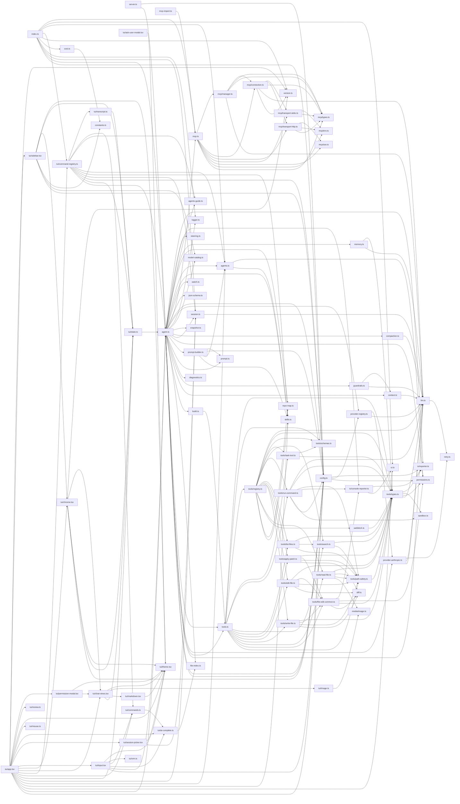

# Architecture dependency graph

> Generated by `node scripts/check-layers.mjs --graph`; do not edit manually.

```mermaid
flowchart LR
  n0[agent.ts] --> n1[config.ts]
  n0[agent.ts] --> n1[config.ts]
  n0[agent.ts] --> n2[llm.ts]
  n0[agent.ts] --> n3[tools.ts]
  n0[agent.ts] --> n4[provider-anthropic.ts]
  n0[agent.ts] --> n3[tools.ts]
  n0[agent.ts] --> n5[file-index.ts]
  n0[agent.ts] --> n6[build.ts]
  n0[agent.ts] --> n7[context.ts]
  n0[agent.ts] --> n8[guardrails.ts]
  n0[agent.ts] --> n9[diagnostics.ts]
  n0[agent.ts] --> n10[prompt.ts]
  n0[agent.ts] --> n11[prompt-builder.ts]
  n0[agent.ts] --> n12[permissions.ts]
  n0[agent.ts] --> n13[session.ts]
  n0[agent.ts] --> n14[compaction.ts]
  n0[agent.ts] --> n15[snapshot.ts]
  n0[agent.ts] --> n16[model-catalog.ts]
  n0[agent.ts] --> n17[logger.ts]
  n0[agent.ts] --> n18[provider-registry.ts]
  n0[agent.ts] --> n1[config.ts]
  n0[agent.ts] --> n19[mcp.ts]
  n0[agent.ts] --> n20[json-schema.ts]
  n0[agent.ts] --> n21[watch.ts]
  n0[agent.ts] --> n22[skills.ts]
  n0[agent.ts] --> n23[agents.ts]
  n0[agent.ts] --> n24[repo-map.ts]
  n0[agent.ts] --> n25[agents-guide.ts]
  n0[agent.ts] --> n26[memory.ts]
  n0[agent.ts] --> n27[steering.ts]
  n0[agent.ts] --> n28[io/console-reporter.ts]
  n0[agent.ts] --> n29[io/reporter.ts]
  n23[agents.ts] --> n22[skills.ts]
  n23[agents.ts] --> n12[permissions.ts]
  n6[build.ts] --> n3[tools.ts]
  n14[compaction.ts] --> n2[llm.ts]
  n1[config.ts] --> n12[permissions.ts]
  n1[config.ts] --> n18[provider-registry.ts]
  n1[config.ts] --> n29[io/reporter.ts]
  n7[context.ts] --> n2[llm.ts]
  n30[cost.ts] --> n31[constants.ts]
  n8[guardrails.ts] --> n2[llm.ts]
  n8[guardrails.ts] --> n7[context.ts]
  n32[index.ts] --> n1[config.ts]
  n32[index.ts] --> n0[agent.ts]
  n32[index.ts] --> n13[session.ts]
  n32[index.ts] --> n17[logger.ts]
  n32[index.ts] --> n30[cost.ts]
  n32[index.ts] --> n33[version.ts]
  n32[index.ts] --> n34[tui/command-registry.ts]
  n32[index.ts] --> n23[agents.ts]
  n32[index.ts] --> n35[ui.ts]
  n32[index.ts] --> n19[mcp.ts]
  n28[io/console-reporter.ts] --> n35[ui.ts]
  n28[io/console-reporter.ts] --> n29[io/reporter.ts]
  n2[llm.ts] --> n36[retry.ts]
  n37[mcp/connection.ts] --> n33[version.ts]
  n37[mcp/connection.ts] --> n2[llm.ts]
  n37[mcp/connection.ts] --> n38[mcp/types.ts]
  n37[mcp/connection.ts] --> n39[mcp/transport-http.ts]
  n37[mcp/connection.ts] --> n40[mcp/transport-stdio.ts]
  n41[mcp/manager.ts] --> n2[llm.ts]
  n41[mcp/manager.ts] --> n38[mcp/types.ts]
  n41[mcp/manager.ts] --> n38[mcp/types.ts]
  n41[mcp/manager.ts] --> n37[mcp/connection.ts]
  n39[mcp/transport-http.ts] --> n38[mcp/types.ts]
  n39[mcp/transport-http.ts] --> n42[mcp/env.ts]
  n39[mcp/transport-http.ts] --> n43[mcp/sse.ts]
  n40[mcp/transport-stdio.ts] --> n38[mcp/types.ts]
  n40[mcp/transport-stdio.ts] --> n42[mcp/env.ts]
  n44[mcp-import.ts] --> n19[mcp.ts]
  n19[mcp.ts] --> n38[mcp/types.ts]
  n19[mcp.ts] --> n42[mcp/env.ts]
  n19[mcp.ts] --> n43[mcp/sse.ts]
  n19[mcp.ts] --> n40[mcp/transport-stdio.ts]
  n19[mcp.ts] --> n39[mcp/transport-http.ts]
  n19[mcp.ts] --> n37[mcp/connection.ts]
  n19[mcp.ts] --> n41[mcp/manager.ts]
  n26[memory.ts] --> n2[llm.ts]
  n26[memory.ts] --> n45[tools/types.ts]
  n11[prompt-builder.ts] --> n22[skills.ts]
  n11[prompt-builder.ts] --> n23[agents.ts]
  n11[prompt-builder.ts] --> n1[config.ts]
  n11[prompt-builder.ts] --> n10[prompt.ts]
  n4[provider-anthropic.ts] --> n2[llm.ts]
  n4[provider-anthropic.ts] --> n2[llm.ts]
  n4[provider-anthropic.ts] --> n36[retry.ts]
  n18[provider-registry.ts] --> n2[llm.ts]
  n18[provider-registry.ts] --> n4[provider-anthropic.ts]
  n46[server.ts] --> n0[agent.ts]
  n46[server.ts] --> n1[config.ts]
  n13[session.ts] --> n2[llm.ts]
  n47[tools/apply-patch.ts] --> n48[diff.ts]
  n47[tools/apply-patch.ts] --> n49[tools/path-safety.ts]
  n47[tools/apply-patch.ts] --> n50[tools/file-edit-common.ts]
  n47[tools/apply-patch.ts] --> n45[tools/types.ts]
  n51[tools/edit-file.ts] --> n48[diff.ts]
  n51[tools/edit-file.ts] --> n49[tools/path-safety.ts]
  n51[tools/edit-file.ts] --> n50[tools/file-edit-common.ts]
  n51[tools/edit-file.ts] --> n45[tools/types.ts]
  n50[tools/file-edit-common.ts] --> n48[diff.ts]
  n50[tools/file-edit-common.ts] --> n45[tools/types.ts]
  n50[tools/file-edit-common.ts] --> n12[permissions.ts]
  n50[tools/file-edit-common.ts] --> n28[io/console-reporter.ts]
  n52[tools/list-files.ts] --> n49[tools/path-safety.ts]
  n52[tools/list-files.ts] --> n53[tools/search.ts]
  n52[tools/list-files.ts] --> n45[tools/types.ts]
  n49[tools/path-safety.ts] --> n45[tools/types.ts]
  n54[tools/read-file.ts] --> n55[media/image.ts]
  n54[tools/read-file.ts] --> n49[tools/path-safety.ts]
  n54[tools/read-file.ts] --> n49[tools/path-safety.ts]
  n54[tools/read-file.ts] --> n45[tools/types.ts]
  n56[tools/registry.ts] --> n22[skills.ts]
  n56[tools/registry.ts] --> n24[repo-map.ts]
  n56[tools/registry.ts] --> n57[webfetch.ts]
  n56[tools/registry.ts] --> n54[tools/read-file.ts]
  n56[tools/registry.ts] --> n58[tools/write-file.ts]
  n56[tools/registry.ts] --> n51[tools/edit-file.ts]
  n56[tools/registry.ts] --> n47[tools/apply-patch.ts]
  n56[tools/registry.ts] --> n52[tools/list-files.ts]
  n56[tools/registry.ts] --> n53[tools/search.ts]
  n56[tools/registry.ts] --> n59[tools/run-command.ts]
  n56[tools/registry.ts] --> n60[tools/task-tool.ts]
  n56[tools/registry.ts] --> n61[tools/schemas.ts]
  n56[tools/registry.ts] --> n45[tools/types.ts]
  n56[tools/registry.ts] --> n2[llm.ts]
  n59[tools/run-command.ts] --> n1[config.ts]
  n59[tools/run-command.ts] --> n62[sandbox.ts]
  n59[tools/run-command.ts] --> n28[io/console-reporter.ts]
  n59[tools/run-command.ts] --> n49[tools/path-safety.ts]
  n59[tools/run-command.ts] --> n45[tools/types.ts]
  n59[tools/run-command.ts] --> n2[llm.ts]
  n53[tools/search.ts] --> n49[tools/path-safety.ts]
  n53[tools/search.ts] --> n45[tools/types.ts]
  n60[tools/task-tool.ts] --> n45[tools/types.ts]
  n60[tools/task-tool.ts] --> n61[tools/schemas.ts]
  n45[tools/types.ts] --> n2[llm.ts]
  n45[tools/types.ts] --> n12[permissions.ts]
  n45[tools/types.ts] --> n62[sandbox.ts]
  n45[tools/types.ts] --> n29[io/reporter.ts]
  n58[tools/write-file.ts] --> n48[diff.ts]
  n58[tools/write-file.ts] --> n49[tools/path-safety.ts]
  n58[tools/write-file.ts] --> n50[tools/file-edit-common.ts]
  n58[tools/write-file.ts] --> n45[tools/types.ts]
  n3[tools.ts] --> n49[tools/path-safety.ts]
  n3[tools.ts] --> n50[tools/file-edit-common.ts]
  n3[tools.ts] --> n54[tools/read-file.ts]
  n3[tools.ts] --> n58[tools/write-file.ts]
  n3[tools.ts] --> n51[tools/edit-file.ts]
  n3[tools.ts] --> n47[tools/apply-patch.ts]
  n3[tools.ts] --> n52[tools/list-files.ts]
  n3[tools.ts] --> n53[tools/search.ts]
  n3[tools.ts] --> n59[tools/run-command.ts]
  n3[tools.ts] --> n60[tools/task-tool.ts]
  n3[tools.ts] --> n56[tools/registry.ts]
  n3[tools.ts] --> n61[tools/schemas.ts]
  n3[tools.ts] --> n45[tools/types.ts]
  n63[tui/app.tsx] --> n1[config.ts]
  n63[tui/app.tsx] --> n0[agent.ts]
  n63[tui/app.tsx] --> n35[ui.ts]
  n63[tui/app.tsx] --> n22[skills.ts]
  n63[tui/app.tsx] --> n23[agents.ts]
  n63[tui/app.tsx] --> n13[session.ts]
  n63[tui/app.tsx] --> n64[tui/state.ts]
  n63[tui/app.tsx] --> n65[tui/commands.ts]
  n63[tui/app.tsx] --> n34[tui/command-registry.ts]
  n63[tui/app.tsx] --> n66[tui/chat-views.tsx]
  n63[tui/app.tsx] --> n67[tui/chrome.tsx]
  n63[tui/app.tsx] --> n68[tui/input.tsx]
  n63[tui/app.tsx] --> n69[tui/session-picker.tsx]
  n63[tui/app.tsx] --> n70[tui/at-complete.ts]
  n63[tui/app.tsx] --> n71[tui/mouse.ts]
  n63[tui/app.tsx] --> n72[tui/theme.tsx]
  n63[tui/app.tsx] --> n73[tui/review.ts]
  n63[tui/app.tsx] --> n74[tui/permission-modal.tsx]
  n63[tui/app.tsx] --> n75[tui/sidebar.tsx]
  n63[tui/app.tsx] --> n33[version.ts]
  n76[tui/ask-user-modal.tsx] --> n72[tui/theme.tsx]
  n70[tui/at-complete.ts] --> n5[file-index.ts]
  n66[tui/chat-views.tsx] --> n64[tui/state.ts]
  n66[tui/chat-views.tsx] --> n77[tui/markdown.tsx]
  n66[tui/chat-views.tsx] --> n78[tui/image.ts]
  n66[tui/chat-views.tsx] --> n72[tui/theme.tsx]
  n67[tui/chrome.tsx] --> n1[config.ts]
  n67[tui/chrome.tsx] --> n64[tui/state.ts]
  n67[tui/chrome.tsx] --> n72[tui/theme.tsx]
  n67[tui/chrome.tsx] --> n66[tui/chat-views.tsx]
  n67[tui/chrome.tsx] --> n33[version.ts]
  n34[tui/command-registry.ts] --> n0[agent.ts]
  n34[tui/command-registry.ts] --> n64[tui/state.ts]
  n34[tui/command-registry.ts] --> n1[config.ts]
  n34[tui/command-registry.ts] --> n13[session.ts]
  n34[tui/command-registry.ts] --> n22[skills.ts]
  n34[tui/command-registry.ts] --> n23[agents.ts]
  n34[tui/command-registry.ts] --> n25[agents-guide.ts]
  n34[tui/command-registry.ts] --> n65[tui/commands.ts]
  n34[tui/command-registry.ts] --> n79[tui/transcript.ts]
  n65[tui/commands.ts] --> n70[tui/at-complete.ts]
  n78[tui/image.ts] --> n55[media/image.ts]
  n68[tui/input.tsx] --> n1[config.ts]
  n68[tui/input.tsx] --> n0[agent.ts]
  n68[tui/input.tsx] --> n70[tui/at-complete.ts]
  n68[tui/input.tsx] --> n65[tui/commands.ts]
  n68[tui/input.tsx] --> n80[tui/vim.ts]
  n68[tui/input.tsx] --> n72[tui/theme.tsx]
  n77[tui/markdown.tsx] --> n72[tui/theme.tsx]
  n74[tui/permission-modal.tsx] --> n66[tui/chat-views.tsx]
  n74[tui/permission-modal.tsx] --> n72[tui/theme.tsx]
  n69[tui/session-picker.tsx] --> n13[session.ts]
  n69[tui/session-picker.tsx] --> n72[tui/theme.tsx]
  n75[tui/sidebar.tsx] --> n1[config.ts]
  n75[tui/sidebar.tsx] --> n16[model-catalog.ts]
  n75[tui/sidebar.tsx] --> n31[constants.ts]
  n75[tui/sidebar.tsx] --> n64[tui/state.ts]
  n75[tui/sidebar.tsx] --> n72[tui/theme.tsx]
  n75[tui/sidebar.tsx] --> n67[tui/chrome.tsx]
  n64[tui/state.ts] --> n0[agent.ts]
  n79[tui/transcript.ts] --> n64[tui/state.ts]
  n57[webfetch.ts] --> n45[tools/types.ts]
```
