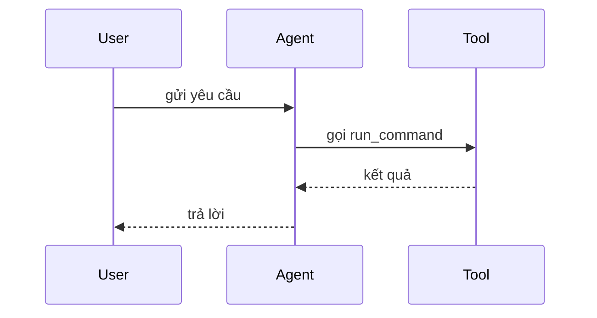

```mermaid
sequenceDiagram
    participant U as User
    participant A as Agent
    participant T as Tool
    U->>A: gửi yêu cầu
    A->>T: gọi run_command
    T-->>A: kết quả
    A-->>U: trả lời
```
